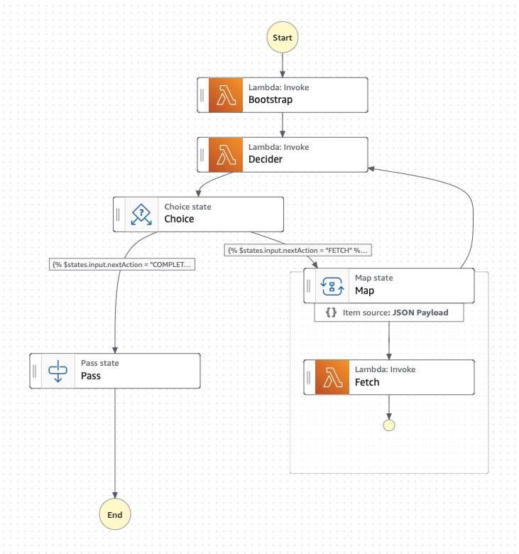

# OpenLibraryScraper

Demo project to build a entity scraper using [AWS Step Functions](https://aws.amazon.com/step-functions/)

## Logic

- During `Bootstrap`, a search is made to the [openlibrary project api](https://openlibrary.org/search.json?q=the+lord+of+the+rings). Additionally 2 random books are selected for download based on [isbn](https://openlibrary.org/isbn/0451137302.json)
- `Decider` checks the next step of the scraper. Since the next page is needed, it should set the nextAction to `FETCH`.
- The `Choice` state should move to the `Map` state.
- `Fetch` is invoked for the next page along with the books.
- Map output is converted to an array and back to the `Decider`
- After 2 pages of loops, the `Decider` should be `COMPLETE`
- The workflow Ends.

## Code

- [workflow](./workflow/ScraperParallelStateMachine.asl.json)
- [fetcher lambda](./lambdas/fetcher.mjs)
- [decider lambda](./lambdas/decider.mjs)

## Sample output

See [sample-output](./sample-output/README.md) for ordered by index for `StateInput` and `StateOutput` at each step.
