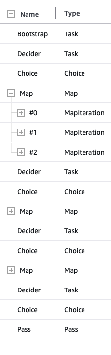

# Sample Output

See json files ordered by index for `StateInput` and `StateOutput` at each step.

| Name      | Type         | Input/Output                            |
| --------- | ------------ | --------------------------------------- |
| Bootstrap | Task         | [json](./00-fetcher-bootstrap.json)     |
| Decider   | Task         | [json](./01-decider.json)               |
| Choice    | Choice       | [json](./02-choice.json)                |
| Map       | Map          | [json](./03-Compose-Map.json)           |
| Map (0)   | MapIteration | [json](./03-Inside-0-MapIteration,json) |
| Map (1)   | MapIteration | [json](./03-Inside-1-MapIteration,json) |
| Map (2)   | MapIteration | [json](./03-Inside-2-MapIteration,json) |
| Decider   | Task         | [json](./04-decider.json)               |
| Choice    | Choice       | [json](./05-choice.json)                |
| Map       | Map          | [json](./06-Compose-Map.json)           |
| Decider   | Task         | [json](./07-decider.json)               |
| Choice    | Choice       | [json](./08-choice.json)                |
| Map       | Map          | [json](./09-Compose-Map.json)           |
| Decider   | Task         | [json](./10-decider.json)               |
| Choice    | Choice       | [json](./11-choice.json)                |
| Pass      | Pass         | [json](./12-choice.json)                |
